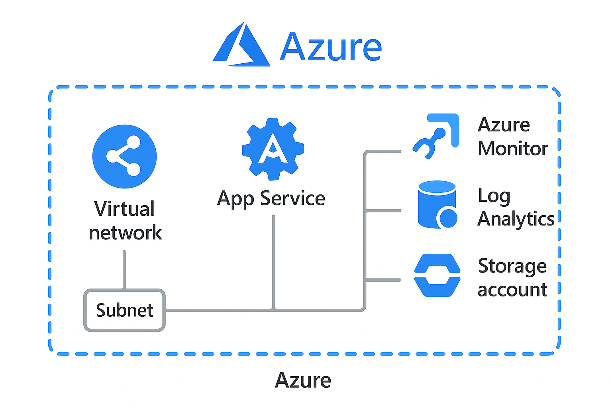

# Azure Infrastructure: Scalable WebApp Deployment

## 📘 Description
Deploy a production-ready Azure infrastructure using App Service, SQL Database, VNet, Monitoring, and Storage Account. This project is designed to show real-world infrastructure design with scalability and monitoring best practices.

## 🧱 Architecture

## ⚙️ Steps
See `steps.md`

## 🏗️ Deployment
See `bicep-template.bicep`

## ✅ Notion Tracker
See `notion-template.md`
