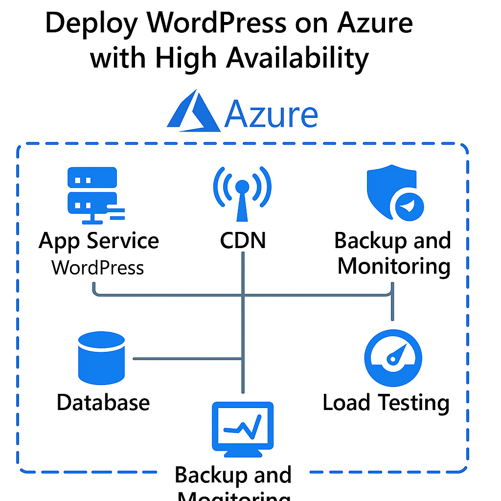

# Deploy WordPress on Azure with High Availability

## 📘 Description
Deploy a highly available WordPress app using Azure App Service, MySQL, CDN, and Storage.

## 🧱 Architecture

## ⚙️ Steps
See `steps.md`

## 🏗️ Deployment
See `bicep-template.bicep`

## ✅ Notion Tracker
See `notion-template.md`
